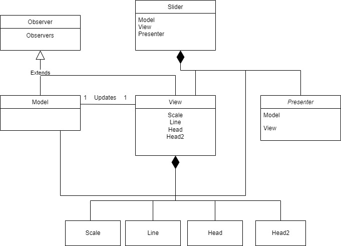

# MetaLamp-4-step

### Совместимость

Плагин совместим с Node v16.13.1 и JQuery v3.6.0

### Ссылка на демо-страницу

https://nurvive.github.io/MetaLamp-4-step/

### Загрузка проекта и запуск тестов

npm i && npm run test

### Остальные команды запуска

npm run dev - запуск dev-сервера

npm run build - запуск билда

npm run lint - запуск линтера

### Использование

Менять настройки плагина можно через метод "Slider" экземпляра класса, например:

    const slider = new Slider({...});
    slider.Slider('showBubble');
    slider.Slider('changeOrientation', 'vertical');

Список доступный настроек:
* showBubble - Показать элемент над ползунком.
* hideBubble - Скрыть элемент над ползунком.
* changeOrientation - Изменить ориентацию на вертикальную или горизонтальную. Принимает 'vertical' или 'horizontal'.
* changeType - Сделать слайдер двойным или одинарным. Принимает 'single' или 'double'.
* changeStep - Изменить шаг ползунка. Принимает переменные типа number.
* changeTo - Изменить текущее значение правого ползунка. Принимает переменные типа number.
* changeFrom - Изменить текущее значение левого ползунка. Принимает переменные типа number.
* changeMax - Изменить максимальное значение слайдера. Принимает переменные типа number.
* changeMin - Изменить минимальное значение слайдера. Принимает переменные типа number.

Также, у плагина есть события onChangeTo и onChangeFrom на которые можно подписаться, передав колбэк в настройках, например:
    
    const slider = new Slider({
        ...
        onChangeTo: function (value) {...}
    })

### Архитектура

Плагин состоит из классов:
**Slider**, **Observer**, **Presenter**, **Model** и **View**.
Реализовано подобие **MVP** архитектуры с пассивным **View**, то есть **Model** и **View** ничего не знают ни друг о друге, ни о **Presenter'e**.

### Observer
Экземпляры этого класса не создаются.
Нужен, чтобы **View** и **Model** наследовались от него и могли уведомлять друг друга об изменениях.

### Slider
Этот класс содержит в себе ссылки на эклемпляры остальных классов.
Через него вызываются методы плагина "Извне".

### Presenter
Зависит от **View** и **Model**.
В этом классе **Model** и **View** подписываются на изменения друг друга с помощью методов **Observer**.

### Model
Этот класс занимается вычислениями значения ползунка, их валидацией и оповещает **View** об этих изменениях.

### View
Реагирует на действия пользвателя и уведомляет **Model** о них.
Отображает **Model**. Т.к. является пассивным, то данные получает из модели путем уведомления.

### SubViews
Для лучшей декомпозиции, класс **View** разбит на подклассы-элементы:
* Line - Линия по которой ходит ползунок, а также прогресс бар
* Scale - шкала значений
* ViewHead - ползунок
* HeadBubble - элемент с текущим значением над ползунком

